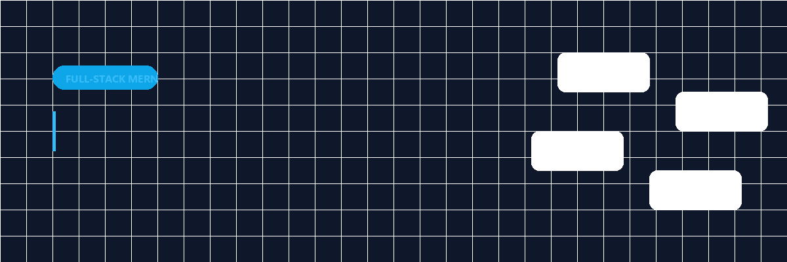

<p align="center">
  
</p>

# Rashel Store Clone

> **A full-stack eCommerce web application meticulously replicating the original Rashel Store.** Features a custom robust backend and a highly responsive, modern frontend UI to handle real-world eCommerce operations gracefully.

<p align="center">
  <a href="https://peppy-manatee-ec0269.netlify.app"><strong>View Live Demo</strong></a> ·
  <a href="#-how-to-use"><strong>Installation Guide</strong></a>
</p>

---

## ✦ What it is

The **Rashel Store Clone** is a comprehensive eCommerce platform built entirely from scratch using the MERN stack (MySQL replacing MongoDB). It demonstrates a pixel-perfect, interactive UI that mirrors the original store, while bringing advanced shopping cart systems, user authentication, and a dynamic product catalog to life.

## ✦ Why it is different

Most clones focus solely on the frontend. This project implements a fully functional backend designed for production-like loads:
- **Full Admin Control:** A dedicated dashboard for store managers to add/edit products, track orders, and update promotional banners dynamically.
- **Relational Integrity:** Instead of MongoDB, this uses **MySQL**, ensuring strict relational constraints for orders, products, and customer profiles.
- **Secure by Default:** JWT-based stateless authentication and Bcrypt password hashing protect all user transactions.

## ✦ Proof & Showcase

### Consumer Storefront


*   **Stunning UI/UX**: Pixel-perfect layout with fluid animations and cross-device responsiveness.
*   **Dynamic Product Catalog**: Browse by categories, bestsellers, and promotions (BOGO deals, Combos).
*   **Shopping Cart System**: Real-time cart state management using React Context.

## ✦ How it works

The architecture is split into two primary decoupled layers:

### Frontend Layer (React.js + Vite)
- Uses **Tailwind CSS** for rapid and consistent styling across complex product grids.
- **React Router DOM** handles client-side routing, keeping navigation instantaneous.
- State is managed via **Context API** (`AuthContext`, `CartContext`) to reduce prop drilling.

### Backend Layer (Node.js + Express)
- A RESTful API built with **Express.js** processes all transactions.
- **MySQL** maintains complex data relations (e.g., matching order variants to inventory).
- Custom middleware verifies **JWT tokens** before granting access to protected routes (like the Admin dashboard).

---

## ✦ How to use

Follow these steps to run the project locally on your machine.

### 1. Prerequisites
- **Node.js** (v16 or higher)
- **Git**
- A local **MySQL** server (e.g., XAMPP, WAMP, or standalone)

### 2. Clone the Repository
```bash
git clone https://github.com/MujtabaZadaii/rashel-store-clone.git
cd rashel-store-clone
```

### 3. Database Setup
1. Open your MySQL management tool.
2. Create a new database named `rashel_store`.
3. Import the SQL schema and seed files located in `backend/database/` to populate tables and mock data.

### 4. Start the Backend
```bash
cd backend
npm install
```
Rename `.env.example` to `.env` and fill in your database credentials:
```env
PORT=5000
DB_HOST=localhost
DB_USER=root
DB_PASSWORD=your_password
DB_NAME=rashel_store
JWT_SECRET=your_jwt_secret
```
Start the API:
```bash
npm run dev
```

### 5. Start the Frontend
In a new terminal window:
```bash
cd frontend
npm install
npm run dev
```
The storefront will be available at `http://localhost:5173`.

---

## ✦ Deployment

*   **Frontend**: Easily deployable to Netlify or Vercel. Set the build command to `npm run build` and publish directory to `dist`.
*   **Backend**: Can be hosted on Render, Railway, or Heroku with environment variables configured.

## ✦ Developer

Developed entirely by **Mujtaba Zadaii** as a portfolio piece demonstrating proficiency in building scalable MERN stack applications, UI replication, and REST API development.

<br/>

<p align="center">
  <a href="https://github.com/oil-oil/beautify-github-readme">
    
  </a>
</p>
